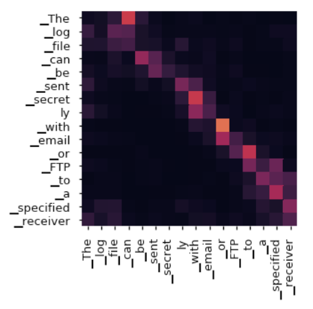
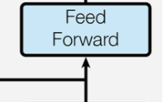

# Transformers From Scratch Kaggle Notebook

Source: https://www.kaggle.com/code/auxeno/transformers-from-scratch-dl
\+ Bunch of conversations with Sonnet4.

### Basics
- Before Transformers, you did LSTM's (RNN), for processing sequential data.
- LSTMs forget on long sequences + training is sequential, not parallelizable
- Transformers solve this, highly scalable/parallel, each "Head" goes independent
- There are 3 types, Encoder, Decoder, Encoder<>Decoder
- Encoder Only = inputs into rich numerical representations (embeddings), attends to tokens at n-i and at n+1, so the whole input sequence. Creates a network with deep understanding of the sequential data, then you can either use that to create embeddings of inputs, or add a classifier head (MLP) that can do sentiment analysis for example.
- Decoder Only = Next Token Prediction, attends previous tokens only, not the ones further (masking).
- Encoder + Decoder = 1) generates embeddings representations (no classifier layer), 2) autoregressively outputs tokens. Used in Translation, Summarization, STT, MultiModal.

<br>

#### Transformer's vs LSTM's (Attention)
Yea, LSTM's already had an attention component, here are the differences:
| Aspect            | LSTM Attention                      | Transformer Self-Attention           |
| ----------------- | ----------------------------------- | ------------------------------------ |
| Processing Order  | Sequential (word-by-word)           | Parallel (all words simultaneously)  |
| Dependencies      | Each step depends on previous steps | All positions computed independently |
| Memory Bottleneck | Fixed-size encoder summary vector   | Direct access to all positions       |
| Parallelization   | Limited due to sequential nature    | Highly parallelizable                |

## Encoder Architecture


- **Input embedding:** input is tokenized (each token/word is converted into vectors)
- **Positional encoding:** provide the transformer with position of each token (in LSTM's this information is known by default cause the proces is sequential, not in Transformers)
- **Multi-Head self-attention:** each token looks at all other tokens to improve it's context understanding moving the vector to a different space, multi-head, means each head learns different relationships, syntax/semantics/verbs. In decoder-only, word n, would only look at prev words [0, n-1].
  - During training it learns where to look for information (attention pattern ~ grid Q,K,V)
- **Add & Norm / Residual:** add the original input tokens to the Attention layer output, helps preventing vanishing gradient problem.
- **Feed forward pos wise:** Learns complex patterns out of Attention Layer, each token is processed individually, which means pos is kept.
- Output **Linear+softmax** (it depends):
  - Wouldn't be needed if you want a model that takes an input and outputs the embeddings, as we already have the semantic understanding.
  - If the task is classsification, probabilities depend on # of options.
  - Linear layer: translates encoder understanding into the expected output
  - Softmax: simply converts into a weighted sum.

<br>

<br>

### Transformer Attention

$
\text{Attention}(Q, K, V) = \mathrm{softmax}\left(\frac{Q K^\top}{\sqrt{d_k}}\right) V
$


**Concepts:**
- **Projecting a vector:** map vector from n dim to n-m dim.
  - dimensionality reduction (compressing information)
  - Information transformation, emphasize some aspects, deemphasize others.
  - Learning more foundational details, by reducing n-dim, projecting it to a smaller space, the model must figure out what's actually crucial features.
  - Represented below as `X*W_Q`, projecting input X into the query weight matrix.
- **Dot Product:** Similarity Measure, similar directions = similar meaning, represented as `@`

<br>

**Basics of Q,K,V Matrices**
- **Query (Q):** "What am I looking for?"
- **Key (K):** "What can I be matched against?"
- **Value (V):** "What actual information do I contain?"

`Q,K,V = X*W_Q, X*W_K, X*W_V`.
`n*m` Notation, means n projecting into m
Suffix `W`, refers to weights (trainable parameters).

**Q:**
- `W_Q` (Query weights) get trained to create queries that find relevant information. So it develops like query templates.
- `X` is the input matrix (tokens, [[],[],[]...]).
- `X` is projecting into `W_Q`, which outputs `Q`. This `X*W_Q` is basically using `W_Q` learned ability to ask questions, to make it specific to the input vector, so `Q`, is the specific query each token/vector should look for.
- Then e.g. `Q_$word` learns "I need to pay attention to: determiners, attributes, and predicates"

**K**: `W_K`, identity templates, `X*W_K` projection is `K`, which uses `W_K` learned ability to determine searchable params/features to make it specific to `X`. `k_$word` then says, this are the things I can be matched against / searched for, which based on ex above, it could be, I can be searched when trying to find nouns, adjectives, connectors, etc.

**V**: "As `V_$word`, this is the information I'll contribute when someone pays attention to me". e.g. `W_V` learns to extract the most useful information from each token - semantic meaning, grammatical role, contextual features, etc.

**Formula Part 1:**

$(Q K^\top)$    - `Q @ K^T`

- `K^T` Transpose, just to match dimensions for matrix multiplication.
- `Q @` (dot product), computes similarity scores on queries/keys.
- **Result:** An attention score matrix where entry (i,j) = "How much should token i attend to token j?"
  - **why?**
  - because we used queries (things that each token should look for), keys (identify things each token can be searched for), we know now based on similarity scores between things to search / things to be searched for, what things it should pay attention to

The model discovers that:
- Nouns should attend to their modifiers
- Adjectives should attend to what they modify
- Verbs should attend to their arguments


**Walkthrough of Part 1:**
```python
"The car is red"

# Q_the = "As 'the', I need to find: the noun I'm modifying"
# Q_car = "As 'car', I need to find: my attributes, determiners, and related predicates" 

# K_the = "I can be matched as: determiner/article pattern"
# K_car = "I can be matched as: noun/subject/entity pattern"

# V_the = "I provide: definiteness, specificity signals"
# V_car = "I provide: vehicle semantics, subject-entity information"

similarity(Q_car, K_the) = HIGH   # car needs its determiner
similarity(Q_car, K_is)  = HIGH   # car needs its predicate  
similarity(Q_car, K_red) = HIGH   # car needs its attribute
similarity(Q_car, K_car) = LOW    # less self-attention needed


attention_scores = Q @ K^T  # Shape: (4, 4)

attention_scores = [
  [0.1, 0.8, 0.3, 0.2],  # How much "The" wants to attend to [The, car, is, red]
  [0.2, 0.9, 0.7, 0.6],  # How much "car" wants to attend to [The, car, is, red]  
  [0.1, 0.8, 0.4, 0.5],  # How much "is" wants to attend to [The, car, is, red]
  [0.3, 0.9, 0.2, 0.1]   # How much "red" wants to attend to [The, car, is, red]
]
```


<br>


**Formula Part 2**

$
\mathrm{softmax}\left(\frac{Part 1}{\sqrt{d_k}}\right) V
$

2.1. **What the /√dk means?**
  - What is `dk`
    ```python
    # Model hyperparameters
    d_model = 512      # Total embedding dimension
    num_heads = 8      # Number of attention heads

    # Each head gets a portion of the total dimension
    dk = d_model // num_heads = 512 // 8 = 64

    # So each head works with 64-dimensional Q, K, V vectors
    ```
    - So dk is simply the size of each query/key vector, check more detail about attention heads in the FAQ below.
  - Why `/√dk`: `Q @ K^T` dot product can be very large, large attention scores, causes extreme softmax, which means vanishing gradients. [ ] Requires more layman explanation.
  - Statistical theory or smth, >> "If you have dk independent random variables, each with variance 1, their sum has variance dk. To keep the variance constant (around 1), you divide by √dk."

2.2 **Softmax**
Once we have `Part1/√dk`, we apply `softmax` to get a weighted sum of % of attention each token should pay to each other, this are the `attention_weights`.

`attention_weights` **meaning:** "I want 40% of *car* info, 20% of *red* info, 30% of *is* info, 10% of *the* info"



2.3. **Dot Product V**
- Takes `attention_weights`, for each token checks how much information each want about every other, retrieves it from `V` and updates itself, moving it's semantic meaning depending.
  - `V` matrix provides: The actual information packages to merge.
  - Matrix multiplication creates: A new token vector that has the semantic representation of the whole sentence as it paid attention to each one of it and grabbed the key pieces.
  - Each token has a new embedding representing all the things it paid attention to.


**Walkthrough:**
```python
attention_weights = softmax(attention_scores)  # Each row sums to 1.0

attention_weights = [
  [0.1, 0.5, 0.2, 0.2],  # "The" attention distribution  
  [0.1, 0.4, 0.3, 0.2],  # "car" attention distribution
  [0.1, 0.4, 0.2, 0.3],  # "is" attention distribution  
  [0.2, 0.6, 0.1, 0.1]   # "red" attention distribution
]

# skipping /square root of dk

# attention_weights @ V

V = [
  [0.1, 0.2, 0.3],  # V_the: determiner information
  [1.0, 0.8, 0.5],  # V_car: vehicle/noun information  
  [0.3, 0.9, 0.1],  # V_is: linking-verb information
  [0.7, 0.2, 0.8]   # V_red: color/adjective information
]

# softmax(Q@K^T) @ V
```

> **The final result is:** we mutate/move each token around the semantic space based on the other tokens it needs to attend to, having a deeper meaning of its representation in the whole input sequence.

<br>
<br>

### FAQ
- **Single vs Multi Head Attention:** the above logic is a single head, each head learns different patterns, and is the parallelization of training. Head 1: Learns syntax relationships (subject-verb), Head 2: Learns semantic relationships (adjective-noun) ... Head n.
  - During training each head focuses on smth different
  - Syntactic Heads, Semantic Heads, Positional Heads.
- **Self-Attention vs Cross Attention:**
  - Self: The sequence "attends to itself", each word attens all other words in input
  - Cross: Q comes from one sequence, K/V from another. Encoder <> Decoder architecture
    - The decoder (K/V) attends the encoder outputs (Q).
- How to determine `embedding_dim`, and `num_heads`?
  - **Embedding dim**
    - This is the big decision in the architecture
    - larger dim, more complex patterns, more expensive, slower training
    - input complexity (sentiment ~ 128-256, language modeling 512-1024, gpt-3/4 ~ 12288)
  - **num_heads** and **head_dim**
    - if embedding size = 512, num_heads=n, head_dim=512/n
    - more heads, more perspectives, but each head is simpler
    - fewer heads, less perspectives, but each head is richer
    - each head receives a slice of each token in the input sequence.
- Why not **sending the whole embedding input into each head?**
  - all heads would learn similar patterns, we want them to specialize contains x information, the other 1/8th, etc?
  - compute just grows absurdly, exponentially. (512*64, to 512*512)
  - It was tried is not better, MQA Google, GQA Llama 2

- What do multiple attention layers do, how do they stack on each other
- How to determine how many heads and layers


<br>
<br>

### Residual Layers (Add & Norm)

- **Add**:
  - `MultiHeadAttention(pos_enc_input) + pos_enc_input`
  - each layer outputs the same tokens, but with it's learned changes, modified vector space, we add that to the original embeddings.
  - why?
    - vanishing gradient problem on deep nn
    - but also don't make huge changes right away (stabilization)
    - helps preserve information, original input is not completely changed.
  - so it's like adding the new insights into the initial token embedding
  - worst case safety: if a layer learns nothing, output as close to original
  - adding vectors means combining information?
    - it depends, if they have same semantic space, if not related/diff dim, no.
    - The model learns to make outputs that work well with the layer
- **Norm**:
  - `nn.LayerNorm`, layer($add_result)
  - After Multi-Head Attention, each token could be:
    ```python
    token_1 = [0.001, 0.002, 0.003]    # Tiny numbers
    token_2 = [1000, 2000, 3000]       # Huge numbers  
    token_3 = [-500, 800, -200]        # Mixed scales
    ```
  - Unstable traninig, huge gradients some, other tiny ones, activations functions to extremes, model doesn't find good learning rates.
  - Allows to stack multiple layers reliably


### Position Wise FFN

- So attention gave us a new representation for each token, having moved the embedding space and having paid attention to each other token correspondingly. We found patterns accross tokens and put the information in it
- Attention gave linear relationships between tokens, **but**, the magic of nn's is in their non-linearity, ffn give us this non linearity, which means more complex patterns.
- The ffn now takes those vectors, and understand what each token (after attention mod) means further.
- what complex meanings emerge after the vector modifications.
  - finding idioms, physical structures, attention heads give us semantic understanding, ffn finds patterns that emerge from semanticness.

**So, wtf is Linearity**
- A function is linear if: f(ax + by) = af(x) + bf(y)
  - predictable proportional behavior, scale input by 2, output scales by 2, add 2 inputs, outp   uts add
- Linear functions can scale (stretch/shrink), rotate, project, combine (weighted sums), cannot create curves, make "if-then" decisions, separate complex patterns.
- Basically all our attention operations are linear, `@` and `*` and `sqrt`
- Why is FFN non linear?
  - example
    ```python
    def ffn(x):
      x = linear1(x)        # Linear: expand dimensions
      x = GELU(x)           # NON-LINEAR: the magic happens here!
      x = linear2(x)        # Linear: compress back
      return x
    ```
- some used non linear functions are GELU, RELU, Tanh, Sigmoid.
- ok but why a non-linear func (curves is clear), but decision boundaries, regions, complex patterns, how does this translates?
  - I think I got it 
    - try to think in a 512 dim space, it's hard, but try. In here geometric regions correspond to semantic spaces.
  - so if you make a line separation, there's just so many rules you can make, color | animals, but not deeper at idioms, or real reference to animals.
  - a subtle change in the inputs will have a much different representation, non-linear \:)
- x^2, or e^x are those non linear? yes, [use logic above to prove it] why don't we use them then?
  - x^2 is always postive, no negative info, gradient issues, dx/dd=2x, at x=0, gradient=0, dead neurons, large x explodes, has no off states, only 0.
  - e^x, explodes, always positive, huge gradients
- but, we could in theory use them, and they could represent complex patterns, they are just not as good.

<br>
<br>


### Training
- How are the transformer weights initialized? (optimal strategies)
- Key ideas on making training stable, 12+layers, not corrupted
- How does backpropagation work through each layer, specially the attention mechanism?
- What is the actual loss function and how does it drive learning?
- How does a single loss function coordinate learning across all these complex components?
- How do the weight matrices W_Q, W_K, W_V actually learn their "templates"?
- What drives them to specialize in query/key/value roles?
- How do they discover what patterns to look for?
- How do attention heads actually specialize during training?
- What forces different heads to learn different patterns?
- Can we predict or control what each head will learn?
- How does information actually flow through the transformer?
- What information is preserved vs. transformed at each layer?
- How do early vs. late layers differ in their function?
- What is the computational complexity and memory usage?
- Detailed analysis of O(n²) attention complexity
- Memory bottlenecks during training vs. inference


<br>

### Inference

<br>

### Why of Architectural Decisions
- Why do these specific architectural choices work so well?
- Why this particular combination of attention + FFN + residuals?
- What happens if you change the order of operations?
- How do you determine optimal model size for a given task?
- The relationship between data size, model parameters, and performance
- When do you get diminishing returns from scaling?

- What are the theoretical limitations of the attention mechanism?
- What types of patterns can/cannot be learned?
- Why does performance degrade with very long sequences?
- How does the transformer architecture relate to other computational models?
- Connections to database queries, memory systems, etc.
- What makes it fundamentally different from CNNs/RNNs?
<br>

## Decoder Architecture
- Explain the differences at each step, in the diagram, in training, and so on.

### Next steps
- [ ] Get to the whiteboard and explain it to yourself and others.
- [ ] Dimensionality changes over the whole input output confuse me a lot.
- [ ] Embeddings? if it's learned, then what's original information? only tokenized sequence?
- [ ] When creating the embeddings, a portion of it represents different things, can that be *interpreted*, like 1/8th
- [ ] Further understand positional encoding, and source code in depth
- [ ] Transformer.params() tells how many params has at each layer.


- [ ] implement and reimplement
- [ ] Try different classifier heads
- [ ] how to train in different data, and make it bigger, require GPU, 100M params
- [ ] from scratch to a decoder only, from scratch as well + walk through each layer as above.
- [ ] implement again
- [ ] SFT on it


<br>

### Testing as a Learning tool

#### `1`
1. Walk through the attention formula Attention(Q,K,V) = softmax(QK^T/√d_k)V step by step. Explain what each matrix multiplication represents, why we divide by √d_k, and what the final output means in terms of information flow.

2. Trace a single token's journey through your transformer implementation from tokenization to final classification. At each step (embedding → positional encoding → attention → residual → FFN → classifier), explain what information is being added, transformed, or preserved, and why each step is necessary.

3. Your implementation uses multiple attention heads, each with embed_dim // num_heads dimensions. Explain why we split dimensions, how different heads can specialize during training, and what happens in the final output linear layer.

4. Your positional encoding uses sin/cos functions with different frequencies. Explain why transformers need positional information at all (vs RNNs), why this mathematical approach works, and what would happen if you removed positional encoding.

5. Your encoder uses x = x + self.attention(hidden_state). Explain the mathematical and practical reasons for residual connections, how they affect gradient flow during backpropagation, and why they're especially critical in deep transformer architectures.

6. Attention operations (Q@K^T, softmax, @V) are mostly linear, while FFN introduces non-linearity. Explain what types of patterns each can learn, why both are necessary, and give examples of what the model couldn't learn with only attention or only FFN.

7. Your implementation is encoder-only with a classifier head. Compare this to decoder-only (like GPT) and encoder-decoder (like T5) architectures. Explain when you'd use each, how attention masking differs, and why your choice fits the classification task.

8. Analyze the dimensionality flow in your implementation: token indices → embeddings → attention → FFN → classification. Explain how you'd decide on embedding_dimensions, num_heads, and num_encoder_layers for different tasks and computational budgets.

9. During training, a single classification loss must coordinate learning across embedding matrices, attention weights (W_Q, W_K, W_V), FFN parameters, and layer norms. Explain how gradients flow back through your architecture and what each component learns to optimize the final objective.

10. Your attention mechanism has O(n²) complexity in sequence length. Explain where this comes from mathematically, why it becomes a bottleneck for long sequences, and what trade-offs you'd consider when scaling to longer inputs or larger models.

`feedback`
- Overall Assessment: 5.4/10, I'd swear I did min 7.
- Strengths: You have good intuition about the big picture and understand key concepts like attention flow, residuals, and architectural differences.
- Weaknesses: Lack precision in mathematical details, confused about information flow specifics, and need deeper understanding of training dynamics.

`suggestions`
- Matrix projection mechanics
  - what it means geometrically, rotating/stretching vectors emphasizing features
  - action: implement the code for it in numpy
- Variance scaling in Attention (√d_k)
  - code random Q,K matrices, compute QK^T, with/out scaling, and see softmax changes
- Layer Normalization vs Batch Normalization
  - Understand math behind each
  - Implement in Transformer, and see how they affect training
- Positional encoding maths
  - check sin/cos patterns for each position, and it's distinguishable patterns
- Gradient flow through attention
  - Manually compute gradients for a 2-token attention example
- What Attention Heads Actually Learn
  - Use attention visualization tools on your trained model to see what patterns emerge.
- FFN's Role in Feature Learning
  - visualize ffn activations to see what patternsit learns
- Training without classification head
  - Implement a simple contrastive loss and train your transformer to create good sentence embeddings.