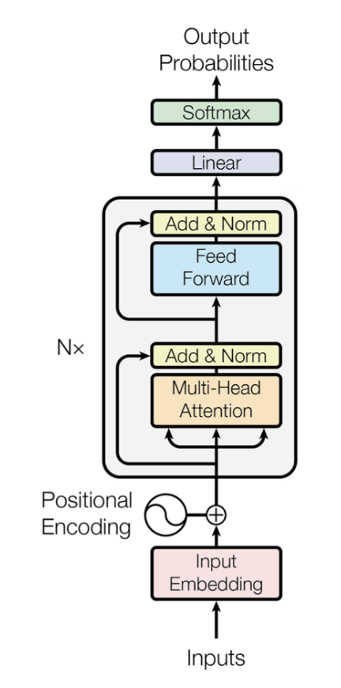

### Other Resources

https://www.kaggle.com/code/auxeno/transformers-from-scratch-dl

- Before Transformers, you did LSTM (RNN), for processing **sequential data**.
- LSTMs forget on long sequences + training is sequential, not parallelizable
- Transformers solve this (training scales), attention pattern understands different portions
- Encoder <> Decoder, 1 learns to represent the inputs (vectors), 2 translates encoded data into output
  - Encoder Only = inputs into rich numerical implementation (embeddings), attend to tokens at n-i, and n+i, full ctx understanding in both directions. BERT. Vector models, e.g. `ada` are an example.
  - Decoder Only = Next Token Prediction, attends previous tokens, (masking), text generation, gpt
  - Encoder + Decoder = 1) generates embeddings, 2) autoregressively outputs tokens. Translation, Summarization.


### Encoder



- Input embedding: input is tokenized (each token/word is converted into vectors)
- Positional encoding: provide TF with position of each token (in LSTM's this information is known by default, not in TF)
- Multi-Head self-attention: each token looks at all other tokens to improve it's context understanding moving the vector to a different space, multi-head, means each head learns different relationships, syntax/semantics/verbs. In decoder-only, word n, would only look at prev words [0, n-1].
  - During training it learns where to look for information (attention pattern ~ grid K*Q*V)
- Add & Norm / Residual: add the original input tokens to the Attention layer output, helps preventing vanishing gradient problem.
- Feed forward: Learns patterns from attention layer, fluffy and cat are adjective/noun.
- Output Linear+softmax (it depends):
  - Wouldn't be needed for embedding models, as we already have the semantic understanding.
  - If the task is sentiment analysis, probabilities depend on # of options (positive/negative)
  - Linear layer: translates encoder understanding into the expected output
  - Softmax: simply converts into a weighted sum.

<br>

#### Attention vs LSTM's
| Aspect            | LSTM Attention                      | Transformer Self-Attention           |
| ----------------- | ----------------------------------- | ------------------------------------ |
| Processing Order  | Sequential (word-by-word)           | Parallel (all words simultaneously)  |
| Dependencies      | Each step depends on previous steps | All positions computed independently |
| Memory Bottleneck | Fixed-size encoder summary vector   | Direct access to all positions       |
| Parallelization   | Limited due to sequential nature    | Highly parallelizable                |

<br>

### Q, K, V

$$
\text{Attention}(Q, K, V) = \mathrm{softmax}\left(\frac{Q K^\top}{\sqrt{d_k}}\right) V
$$


**Concepts:**
- Projecting a vector: map vector from n dim to n-m dim.
  - dimensionality reduction (compressing information)
  - Information transformation, emphasize some aspects, deemphasize others.
  - Learning more foundational details, by reducing n-dim, projecting it to a smaller space, the model must figure out what's actually crucial features.
  - Represented below as `X*W_Q`, projecting input X into the query weight matrix.
- Dot Product: Similarity Measure, similar directions = similar meaning, represented as `@`

<br>

Q,K,V
- Query (Q): "What am I looking for?"
- Key (K): "What can I be matched against?"
- Value (V): "What actual information do I contain?"

`Q @ K^T`
**Attention Scores** = , how much each query "matches" with each key. This is a matrix that tells each word, how much attention to pay to each other word.

`Q,K,V = X*W_Q, X*W_K, X*W_V`.

**Q:**
- `W_Q` learns to create queries that find relevant info. So has like question templates. Trainable params.
- `X` is the input matrix (tokens, [[],[],[]...]).
- `X` is projecting into `W_Q`, which outputs `Q`. This `X*W_Q` is basically using `W_Q` learned ability to ask question, to make it specific to the input vector, so `Q`, is the specific question to be asked given the input. So for each token (as this is a matrix), is basically
- Then e.g. `Q_$word` asks = As $word, what do I pay attention to

**K**: `W_K`, identity templates, `X*W_K` projection is `K`, which uses `W_K` learned ability to identify searchable identities to make it specific to `X`. `k_$word` then says, this are the things I can be matched against / searched for.

**V**: "As `V_$word`, this is the information I'll contribute when someone pays attention to me". e.g. `W_V` learns that, Nouns provide: Rich semantic content about entities. Adjectives provide: Descriptive/attributive information.

The model discovers that:
- Nouns should attend to their modifiers
- Adjectives should attend to what they modify
- Verbs should attend to their arguments

Example:
```python
"The car is red"

# Q_the = "As 'the', I need to find: the noun I'm modifying"
# Q_car = "As 'car', I need to find: my attributes, determiners, and related predicates" 

# K_the = "I can be matched as: determiner/article pattern"
# K_car = "I can be matched as: noun/subject/entity pattern"

# V_the = "I provide: definiteness, specificity signals"
# V_car = "I provide: vehicle semantics, subject-entity information"

similarity(Q_car, K_the) = HIGH   # car needs its determiner
similarity(Q_car, K_is)  = HIGH   # car needs its predicate  
similarity(Q_car, K_red) = HIGH   # car needs its attribute
similarity(Q_car, K_car) = LOW    # less self-attention needed


attention_scores = Q @ K^T  # Shape: (4, 4)

attention_scores = [
  [0.1, 0.8, 0.3, 0.2],  # How much "The" wants to attend to [The, car, is, red]
  [0.2, 0.9, 0.7, 0.6],  # How much "car" wants to attend to [The, car, is, red]  
  [0.1, 0.8, 0.4, 0.5],  # How much "is" wants to attend to [The, car, is, red]
  [0.3, 0.9, 0.2, 0.1]   # How much "red" wants to attend to [The, car, is, red]
]
```


<br>

Once we have `K @ Q^T`, we do `softmax` to get a weighted sum of % of attention to pay to each other, this are the `attention_weights`

Then do `@` dot product with `V` matrix, this takes `attention_weights`, for each row/token checks how much information each want about every other, retrieves it and updates itself, moving it's semantic meaning depending.

- Attention weights say: "I want 40% of *car* info, 20% of *red* info, 30% of *is* info, 10% of *the* info"
- `V` matrix provides: The actual information packages to merge.
- Matrix multiplication creates: A new token vector that has the semantic representation of the whole sentence as it paid attention to each one of it and grabbed the key pieces.
  - Outputs a new value of X, so also restores to correct dimensions after dot product.


```python
attention_weights = softmax(attention_scores)  # Each row sums to 1.0

attention_weights = [
  [0.1, 0.5, 0.2, 0.2],  # "The" attention distribution  
  [0.1, 0.4, 0.3, 0.2],  # "car" attention distribution
  [0.1, 0.4, 0.2, 0.3],  # "is" attention distribution  
  [0.2, 0.6, 0.1, 0.1]   # "red" attention distribution
]

# skipping /square root of dk

# attention_weights @ V

V = [
  [0.1, 0.2, 0.3],  # V_the: determiner information
  [1.0, 0.8, 0.5],  # V_car: vehicle/noun information  
  [0.3, 0.9, 0.1],  # V_is: linking-verb information
  [0.7, 0.2, 0.8]   # V_red: color/adjective information
]

# softmax(Q@K^T) @ V

# we get a new X representation.
```

> **The final result is:** we mutate/move each token around the semantic space based on the other tokens it needs to attend to, having a deeper meaning of its representation in the whole input.

<br>
<br>

### FAQ
- Single vs Multi Head Attention: the above logic is a single head, each head learns different patterns, and is the parallelization of training. Head 1: Learns syntax relationships (subject-verb), Head 2: Learns semantic relationships (adjective-noun) ... Head n.
  - During training each head focuses on smth different
  - Syntactic Heads, Semantic Heads, Positional Heads.
- Self-Attention vs Cross Attention
  - Self: The sequence "attends to itself", each word attens all other words in input
  - Cross: Q comes from one sequence, K/V from another. Encoder <> Decoder architecture
    - The decoder (K/V) attends the encoder outputs (Q).
- What's `dK`?
  ```python
  # Model hyperparameters
  d_model = 512      # Total embedding dimension
  num_heads = 8      # Number of attention heads

  # Each head gets a portion of the total dimension
  dk = d_model // num_heads = 512 // 8 = 64

  # So each head works with 64-dimensional Q, K, V vectors
  ```
  - So dk is simply the size of each query/key vector - determines how much information each vector can encode.
- What the /√dk means
  - `Q @ K^T` dot product can be very large, large attention scores, causes extreme softmax, which means vanishing gradients.
- Why ^T of K?
  ```python
  # Shapes:
  Q: (sequence_length, d_k)  # e.g., (4, 64)
  K: (sequence_length, d_k)  # e.g., (4, 64)

  # Trying Q @ K (without transpose):
  (4, 64) @ (4, 64)  # can't dot product this
  ```
  - Makes dimensions compatible
  - Computes all pairwise similarities in 1 op
- What do multiple attention layers do, how do they stack on each other
- How to determine how many heads and layers