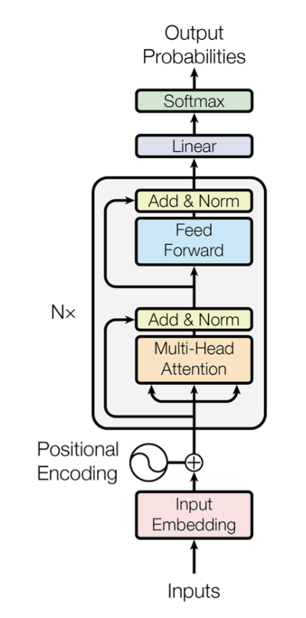
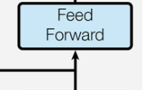
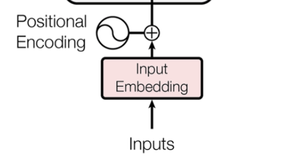

# Mastering Transformers

> Mastering Transformers in 60 days, and becoming an AI Researcher.

[Goal and resources](https://docs.google.com/document/d/1W6N9xQ3Giz7lK243EkP5GBJQu9cSSzHr-P5A7oRb7Eo/edit?usp=sharing).

Each word here was thought, not generated.


### Table of Contents

- [Mastering Transformers](#mastering-transformers)
    - [Table of Contents](#table-of-contents)
    - [Basics](#basics)
      - [Transformer's vs LSTM's](#transformers-vs-lstms)
  - [Encoder Architecture](#encoder-architecture)
      - [Each Section Briefly Explained](#each-section-briefly-explained)
    - [Attention Details](#attention-details)
      - [Basics of Q,K,V Matrices](#basics-of-qkv-matrices)
      - [Formula Part 1](#formula-part-1)
      - [Formula Part 2](#formula-part-2)
    - [Residual Layers (Add \& Norm)](#residual-layers-add--norm)
      - [Add](#add)
      - [Norm](#norm)
    - [Position Wise FFN](#position-wise-ffn)
    - [FAQ](#faq)
  - [Decoder Architecture](#decoder-architecture)
  - [Positional Encoding \& Embeddings](#positional-encoding--embeddings)
  - [Training](#training)
  - [Inference](#inference)
  - [Interpretability and Visualizing](#interpretability-and-visualizing)
  - [Arguing Architectural Decisions](#arguing-architectural-decisions)
  - [Tasks](#tasks)


### Basics
- **Before Transformers**, you used LSTM's (RNN's) for processing sequential data.
- issue with **LSTMs**: They forget on long sequences + training is sequential, not parallelizable, hard to scale. (Though, [RWKV](https://wiki.rwkv.com/) is starting to solve this)
- **Transformers** solved this, being highly scalable/parallel, each "Attention Head" process separately, as well as each input token.
- **Attention:** How much each token/word in the input needs to "pay attention" to each other, like how much the meaning of token n changes based on all other tokens in the sequence.
- 3 types of Transformers architectures, Encoder, Decoder, Encoder<>Decoder.
- **Encoder Only** = n token pays attention to n-1 and n+1 (all the input tokens), output can be a simple classifier layer on top. Used on tasks where language input classificationis needed. (Not generation)
- **Decoder Only** = n token only pays attention to n-1 tokens, previous ones, "autoregressive generation", GPT like.
- **Encoder <> Decoder** = Encoder generates part of attention (lookup table), Decoder uses it to map its inputs into a transformed output. Used in Translation, Summarization, STT, MultiModal.

<br>

#### Transformer's vs LSTM's
- Section requires better understanding of LSTM's vs Transformers
- Specially LSTM's attention.

<br>
<br>

## Encoder Architecture



#### Each Section Briefly Explained

- **Input embedding:** input is tokenized (int) (each token/word is mapped to an int), then each token is expanded to an `embedding` vector that later learns to represent the token in more detail.
- **Positional encoding:** provide the attention layer with position of each token (in LSTM's this information is known by default cause the proces is sequential, not in Transformers attention), is not because row order can't be traced throughout matrix operations, but attention is computed in parallel and only from embeddings, we need to insert the position in the embedding, so attention can understand, noun comes before subject, or things like that. This is done via sin/cos waves patterns.
- **Multi-Head self-attention:** Each token looks at all other tokens to improve its context understanding moving the embedding vector to a different space with richer meaning, `multi-head`, means is done by multiple (smaller) matrices/heads, each one focusing on  different relationships, syntax/semantics/verbs. 
- **Add & Norm / Residual:** add the original input tokens to the Attention layer output, helps preventing `vanishing gradient` problem + normalization.
- **Feed forward pos wise:** Learns complex patterns out of Attention Layer, each token is processed individually, which means position is kept. This layer learns deeper individual tokens meanings. why? non-linearity the magic of Neural networks. Attention is linear operations, so in the semantic space it will be able to separate `animal | color`, this `FFN` understands `animal analogy` | `animal idiom` | `real animal`.
- Output **Linear+softmax:** You use your network with language understanding layers to apply a basic nn to classify inputs. e.g. Sentiment analysis. Output neurons is a prob distribution `softmax` between "positive" "negative" "neutral".

<br>

<br>

### Attention Details

> This is the most relevant piece.

$
\text{Attention}(Q, K, V) = \mathrm{softmax}\left(\frac{Q K^\top}{\sqrt{d_k}}\right) V
$


**Prerequisites:**
- **Vector Projection:** map vector from n dim to n-m dim.
  - This is just `__matmul__`, matrix multiplication. `X @ Y`
  - This causes **dimensionality** transformation (generally reduction, or compressing information)
  - **Information** transformation = as `X` is changing its dimension space, it's moving its meaning to `Y` dimension space, X is being forced to compress/transform its features, and find the most relevant to represent itself at `Y`.
  - `X @ Y` projected, means X is being moved into the `Y` dimensionality space.
  - **Analogy** `Y`=lens, `X`=scene, `O`=photo, lens never change, but photo is the scene via the lens used.
  - I'll represent it below as `X @ Y`,
  - Example with `X @ W_Q`:
    - `Q` Matrix above in the formula  is the result of `X @ W_Q`
    - What is `W_Q` = a matrix with weights that we train (later explain what it means)
    - Projecting input `X` into the query weight matrix means `X` (input token) is being transformed by `W_Q`, or `X` is being projected into the Query space.
  - Check [projection.py](02-transformers-from-scratch/_4_projection.py) for an exercise with deeper understanding
- **Dot Product:** Similarity Measure, similar directions = similar meaning, represented as `*`

<br>

- [ ] A linear algebra notebook will be added soon covering most important operations

<br>

#### Basics of Q,K,V Matrices
- **Query (Q):** "What am I looking for?"
- **Key (K):** "What can I be matched against?"
- **Value (V):** "What actual information do I contain?"

`Q,K,V = X @ W_Q, X @ W_K, X @ W_V`.
`n @ m` Notation, means n projecting into m
Prefix `W`, refers to weights (trainable parameters).

**X:**
- Refers to input sequence.
- Matrix with each row being the embedding vector of token i.

**Q:**
- `W_Q` (Query weights) get trained to create queries that find relevant information. So it develops like query templates.
- `X` is projecting into `W_Q`, which outputs `Q`. This `X*W_Q` is basically using `W_Q` learned ability to ask questions, to make it specific to the input vector, so `Q`, is the specific query each token/vector should look for.
- `W_Q` = "what do I need to pay attention to". `Q` says, as `Q_$word` "I need to pay attention to: determiners, attributes, and predicates"

**K**: `W_K`, identity templates, `X @ W_K` projection is `K`, which uses `W_K` learned ability to determine searchable params/features to make it specific to `X`. `k_$word` then says, this are the things I can be matched against / searched for, which based on the ex above, it could be, "I can be searched when trying to find nouns, adjectives, connectors", etc.

**V**: "As `V_$word`, this is the information I'll contribute when someone pays attention to me". e.g. `W_V` learns to extract the most useful information from each token - semantic meaning, grammatical role, contextual features, etc.

<br>

#### Formula Part 1

$(Q K^\top)$    - `Q * K^T`

- Here we already projected `X` into `W_Q`, `W_K`, giving us `Q`, `K`, which `Q` tells us for each token in `X`, this are the things I'm looking to pay attention to, and `K`  fo each token in `X`, this are the I can be searched for.
- `K^T` Transpose, just to match dimensions for dot product to work.
- `*` (dot product), computes similarity scores on queries/keys.
- **Result:** A matrix known as `Attention Scores` where entry (i,j) = "How much should token i attend to token j?" 
  - **why/how?** because we used queries (things that eac token should look for), keys (identify things each token can be searched for), we know now based on similarity scores between things to search / things to be searched for, what things it should pay attention to.


During training the model discovers that:
- Nouns should attend to their modifiers
- Adjectives should attend to what they modify
- Verbs should attend to their arguments


**Walkthrough:**
```python
_input = "The car is red"

# Q_the = "As 'the', I need to find: the noun I'm modifying"
# Q_car = "As 'car', I need to find: my attributes, determiners, and related predicates" 

# K_the = "I can be matched as: determiner/article pattern"
# K_car = "I can be matched as: noun/subject/entity pattern"

# (used later)
# V_the = "I provide: definiteness, specificity signals"
# V_car = "I provide: vehicle semantics, subject-entity information"

similarity(Q_car, K_the) = HIGH   # car needs its determiner
similarity(Q_car, K_is)  = HIGH   # car needs its predicate  
similarity(Q_car, K_red) = HIGH   # car needs its attribute
similarity(Q_car, K_car) = LOW    # most tokens have low attention to themselves


attention_scores = Q * K^T  # Shape: (4, 4)

attention_scores = [
  [0.1, 0.8, 0.3, 0.2],  # How much "The" wants to attend to [The, car, is, red]
  [0.2, 0.9, 0.7, 0.6],  # How much "car" wants to attend to [The, car, is, red]  
  [0.1, 0.8, 0.4, 0.5],  # How much "is" wants to attend to [The, car, is, red]
  [0.3, 0.9, 0.2, 0.1]   # How much "red" wants to attend to [The, car, is, red]
]
```


<br>


#### Formula Part 2

$
\mathrm{softmax}\left(\frac{Part 1}{\sqrt{d_k}}\right) V
$

2.1. **What the /√dk means?**
  - What is `dk`
    ```python
    # Model hyperparameters
    d_model = 512      # Total embedding dimension
    num_heads = 8      # Number of attention heads

    # Each head gets a portion of the total dimension
    dk = d_model // num_heads = 512 // 8 = 64

    # So each head works with 64-dimensional Q, K, V vectors
    ```
    - So dk is simply the size of each query/key vector, check more detail about attention heads in the FAQ below.
  - Why `/√dk`: `Q * K^T` dot product can be very large, large attention scores, causes extreme softmax, which means vanishing gradients
  - [ ] Requires deeper understanding of variance in statistics.

<br>
  

2.2 **Softmax**
Turns a bunch of values into a % that sum up to 1 (weighted sum).
[Pytorch documentation](https://docs.pytorch.org/docs/stable/generated/torch.nn.Softmax.html)

Once we have `Part1/√dk`, we apply a `softmax` to get a weighted sum of % of attention each token should pay to each other, this are the `attention_weights`.

`attention_weights` **meaning:** as token "The", "I want 40% of *car* info, 25% of *red* info, 35% of *is* info.

- [ ] Include images of pattern generated by attention_viz_exercise.py 

<br>

2.3. **attention_weights \* V**
- Using `attention_weights` (knowing how much attention to get from every other token), retrieves that information from `V`.
  - `V` matrix provides: The actual information each token provides.
  - **Output:** The input tokens but after paying attention to every other relevant token in the input sequence, which moved them around the embedding space to have a much richer contextual representation.

<br>

**Walkthrough:**
```python
attention_weights = softmax(attention_scores)  # Each row sums to 1.0

attention_weights = [
  [0.1, 0.5, 0.2, 0.2],  # "The" attention distribution  
  [0.1, 0.4, 0.3, 0.2],  # "car" attention distribution
  [0.1, 0.4, 0.2, 0.3],  # "is" attention distribution  
  [0.2, 0.6, 0.1, 0.1]   # "red" attention distribution
]

# skipping /square root of dk

# attention_weights * V

V = [
  [0.1, 0.2, 0.3, 0.4],  # V_the: determiner information
  [1.0, 0.8, 0.5, 0.2],  # V_car: vehicle/noun information  
  [0.3, 0.9, 0.1, 0.3],  # V_is: linking-verb information
  [0.7, 0.2, 0.8, 1.0]   # V_red: color/adjective information
]

# softmax(Q * K^T) * V
```

> **The final result is:** we mutate/move each token around the semantic space based on the other tokens it needs to attend to, updating each token to a deeper meaning of its representation in the whole input sequence.

<br>
<br>

### Residual Layers (Add & Norm)

#### Add
- `MultiHeadAttention(pos_enc_input) + pos_enc_input`
- The attention layer outputs the input tokens but with its learned changes, having modified vector space, we take that and add the initial positional_encoded_input.
- why?
  - vanishing gradient problem on deep neural networks.
  - but also don't make huge changes right away (stabilization)
  - helps preserve information, original input is not completely changed.
- so it's like adding the new insights into the initial token embedding
- worst case safety: if a layer learns nothing, output as close to original
- adding vectors means combining information?
  - it depends, if they have same semantic space, if not related/diff dim, no.
  - The model learns to make outputs that work well with the layer

#### Norm
- `nn.LayerNorm`, layer($add_result)
- After Multi-Head Attention, each token could be:
  ```python
  token_1 = [0.001, 0.002, 0.003]    # Tiny numbers
  token_2 = [1000, 2000, 3000]       # Huge numbers  
  token_3 = [-500, 800, -200]        # Mixed scales
  ```
- Unstable training, huge gradients some, other tiny ones, activations functions to extremes, model doesn't find good learning rates.
- Allows to stack multiple layers reliably

<br>

### Position Wise FFN

- So attention gave us a new representation for each token, having moved its embedding space position and having paid attention to each other token correspondingly. We found patterns across tokens and put the information in it.
- Attention gave linear relationships between tokens, **but**, the magic of nn's is in their non-linearity, ffn give us this non linearity, which means more complex patterns.
- The ffn now takes those vectors, and understand what each token (after attention modified them) means further.
- what complex meanings emerge after the vector modifications.
  - finding idioms, physical structures, attention heads give us semantic understanding, ffn finds patterns that emerge from semanticness.

**So, wtf is Linearity**
- A function is linear if: f(ax + by) = af(x) + bf(y)
  - predictable proportional behavior, scale input by 2, output scales by 2, add 2 inputs.
- Linear functions can scale (stretch/shrink), rotate, project, combine (weighted sums), cannot create curves, make "if-then" decisions, separate complex patterns.
- Basically all our attention operations are linear, `@` and `*` and `sqrt`
- Why is `FFN` non linear?
  - example
    ```python
    def ffn(x):
      x = linear1(x)        # Linear: expand dimensions
      x = GELU(x)           # NON-LINEAR: the magic happens here!
      x = linear2(x)        # Linear: compress back
      return x
    ```
- some used non linear functions are `GELU`, `RELU`, `Tanh`, `Sigmoid`.
- ok but why a non-linear func (curves is clear), but decision boundaries, regions, complex patterns, how does this translates?
  - **I think I got it**
    - try to think in a 512 dim space, it's hard, but try. In here geometric regions correspond to semantic spaces. Correspond to if/then decisions.
  - so if you make a line separation, there's just so many rules you can make, color | animals, but not deeper at idioms, or real reference to animals.
  - a subtle change in the inputs will have a much different representation, non-linear \:)
- `x^2`, or `e^x` are those non linear? yes, [use logic above to prove it] why don't we use them then?
  - `x^2` is always postive, no negative info, gradient issues, `dx/dd=2x`, at `x=0`, gradient=0, dead neurons, large x explodes, has no off states, only 0.
  - `e^x`, explodes, always positive, huge gradients
- but, we could in theory use them, and they could represent complex patterns, they are just not as good.

<br>
<br>

### FAQ
- **Single vs Multi Head Attention:** each head learns different patterns, and is the parallelization of training. Head 1: Learns syntax relationships (subject-verb), Head 2: Learns semantic relationships (adjective-noun) ... Head n.
  - During training each head focuses on smth different
  - Syntactic Heads, Semantic Heads, Positional Heads.
- **Self-Attention vs Cross Attention:**
  - Self: The sequence "attends to itself", each word attens all other words in input
  - Cross: Q comes from one sequence, K/V from another. Encoder <> Decoder architecture
    - The decoder (K/V) attends the encoder outputs (Q).
- How to determine `embedding_dim`, and `num_heads`?
  - **Embedding dim**
    - This is the big decision in the architecture
    - larger dim, more complex patterns, more expensive, slower training
    - input complexity (sentiment ~ 128-256, language modeling 512-1024, gpt-3/4 ~ 12288)
  - **num_heads** and **head_dim**
    - if embedding size = 512, num_heads=n, head_dim=512/n
    - more heads, more perspectives, but each head is simpler
    - fewer heads, less perspectives, but each head is richer
    - each head receives a *slice of each input token*.
- Is it actually slicing each embedding token?
  - Not really!!, `self.q = nn.Linear(embed_dim, head_dim)`, input dim is `embed_dim`, `W_Q` receives the whole thing, but we then are projecting `X @ W_Q` to get `Q`, and this one is actually of a smaller size, cause `head_dim` output is embed_dim/n_heads.
  - We take each token embedding and project it to W_Q, X @ W_Q, and that way we get Q, which has 1/8th dimensionality reduction!!
- Why not **having Q,K,V** of size `embed_dim*embed_dim`, instead of `embed_dim*1/n_heads`?
  - all heads would learn similar patterns, we want them to specialize contains x information, each head's projection learns different patterns of language
  - compute just grows absurdly, exponentially. (512*64, to 512*512)
  - It was tried is not better, MQA Google, GQA Llama 2
- What's the **loss function**, what's the source of truth?
  - `tokenizer` is the only source of truth we have, embeddings are params, attention Q,K,V and W_O are params, FFN are params.
  - **Encoder only** = we have labels, so is just a normal classifier output, prob of every option
    - What if we want to get a **sequence embeddings model**? (no classifier head)
    `MLM` and `NSP` (BERT), Contrastive Learning (compare 2 similar inputs, cosine similarity loss).
  - **Decoder only** = output log prob of the whole vocabulary (all possible tokens), how likely each token is to be the next one, we have the whole input sequence, so we can compare (self-supervised-learning).
  - **Encoder <> Decoder** = we have labels, supervised learning, for translation, summarization, so it's again log prob vs ground truth.
- **Why does this work at all?**
  - gradient flows through everything, all updates based on final loss
  - each component job emerges
    - Embeddings: Learn to represent tokens in a useful space
    - `W_Q`, `W_K`, `W_V`: Learn to find relevant relationships between tokens
    - FFN: Learn to transform and combine information
    - Classifier: Learn to map final representations to predictions
  - Scale (tokens, params, compute) + simple objective
  - Enough learning capacity (params), enough data, a clear objecive, gradient descent.
- How do we **merge multiple attention heads** outputs?
  - Example
    ```python
    head_1 = [0.2, 0.8, 0.1, 0.9]  # Maybe focuses on syntax
    head_2 = [0.7, 0.3, 0.6, 0.2]  # Maybe focuses on semantics  
    head_3 = [0.1, 0.5, 0.8, 0.4]  # Maybe focuses on position
    # concat = [head_1, head_2, head_3] # (1x12)
    # linear_layer_shape = 12x4
    # output of concat @ linear_layer = (1x4)
    # effectively combining the multiple heads outputs
    ```
  - concatenate, put outputs side by side, in a single vector.
  - add a linear layer that combines all, learns to take 30% from h1 (syntax), 50% h2 (semantics), and so on
  - Basically learns the optimal mixing rations depending on word/context, **mix the different types of attention learned**
- What do multiple **attention layers** do, how do they **stack** on each other?
  - 1 complete encoder block: (mha - residual - ffn - residual), gpt 3 has 96 blocks.
  - 1 attention layer, means the mha layer in the block.
  - how many to stack together?
    - empirical scalling laws, chinchilla scaling laws, common existing sizes
    - [ ] Further writing about this is required
    - bigger, more learnings, harder to train, if dataset is small, risk overfitting.
- **Dimensionality changes are confusing**:
  > This will not make it clearer, but it's an attempt. Maybe I'll understand it when I go through this later. 
  - input string sequence
  - **tokenizer** converts to a list of integers `[sequence_length]`
  - **batch_size** is just processing inputs in parallel through the network (a single backpropagation turn is made)
  - now we have `[batch_size, sequence_length]`
  
  - **Embedding** layer shape: `[tokenizer_vocab_size, embedding_dim]` this is a lookup table, not a matmul, so output here is `[batch_size, sequence_length, embedding_dim]`, we just add the embedding dimension
  - **pos_encoding** layer shape: `[max_token_length, 1, embedding_dim]`, this is just  modifying our token embeddings to give them a position signal. So output remains the same as above. `[batch_size, sequence_length, embedding_dim]`
  - **head_dim** = embedding_dim/num_heads
  - **Attention:**
    - `W_Q/W_K/W_V` shape: `[head_dim, embedding_dim]`
    - After taking `pos_encoding_output @ W_Q/K/V`, we get `Q,K,V`
      - or `[batch_size, sequence_length, embedding_dim]` @ `[batch_size, head_dim, embedding_dim]`
    - So `Q,K,V` shape is: `[batch_size, sequence_length, head_dim]`
    - `K^T` = .transpose(1,2), switches e.g. from [1, 6, 16] to [1, 16, 6]
    - Q * K^T 
      - `[batch_size, sequence_length, head_dim]` * `[batch_size, head_dim, sequence_length]`
      - = `[batch_size, sequence_length, sequence_length]`
      - here we do `softmax` and get `attention_weights`
    - **attention_weights** `* V` shape is:  `[batch_size, sequence_length, sequence_length]` * `[batch_size, sequence_length, head_dim]` = `[batch_size, sequence_length, head_dim]`
    - `W_O` = input is concat of each head output at `-1` dim = `[batch_size, sequence_length, concatenate (head_dim, num_heads times)]`
      - refreshing: `head_dim` is `embedding_dim/num_heads`
      - Final output is `[batch_size, sequence_length, embed_dim]`
  - residual layer doens't change dimensions
  - FFN
  - Final classifier output
  - each layer has now implemented `.get_dimensions()`
<br>
- [ ] understand the logic on matmul/dot on n dimensions > 2

<br>

## Decoder Architecture
- Explain the differences at each step, in the diagram, in training, and so on.

<br>

## Positional Encoding & Embeddings



> so confusing

- [ ] A more in depth analysis of sin/cos + refresh on its meaning is needed
- [ ] I'm still not fully grasping this

<br>

Quoting my explanation above:
> Provide the attention layer with position of each token (in LSTM's this information is known by default cause the proces is sequential, not in Transformers attention). 
> 
> Is not because row order can't be traced through the operations, but attention is computed in parallel and only from embeddings data, we need to insert the position in the embedding, so attention can understand it, e.g. *noun comes before subject*, or things like that.


- **1st Q**: "wait, but can't the rows just be traced around in the multiple matrix operations, and just retrieve the index?
  - The answer is that the attention layer wasn't made with this in mind, each token embedding is processed in parallel, and only the embedding is taken, nothing else, so we gotta tell the layer through the embedding what's its position
  - Apparently was a simpler way of doing it, lol.
- **2nd Q**, "why at moment of processing each embedding in `Attention` we don't just, let the layer know about the index?" -> the answer is yes, modern architectures do this positional encoding differently, Tf-XL, T5, DeBERTa.
- **3rd Q**, "so how does a sin/cos wave tell the attention layer that this other token comes behind you, and this is what it means"
  - Part of the answer: 
    - Each position 0,1,...,n, get's aidfferent sin/cos pattern
    - Let's say n token is at idx 5, and m is idx 8, 3 positions apart would have a consistent math relationship as if they were index 0 and 3.
    - This would mean we are rather showing the model relative distances between tokens, so if abs `(token_n.idx8-token_m.idx11)` = `(token_n.idx5-token_m.idx8)`
- **4th Q:** Why is the embedding not broken? like, we randomly initialize it (learned params), and then we just add sin/cos waves and not breaking what it's learning. How can even the attention layer be able to separate what this mean at a position level.
- Isn't this changing any way on every training run? how's position kept.


<br>
<br>


## Training
- How are the transformer weights initialized? (optimal strategies)
- Key ideas on making training stable, 12+layers, not corrupted
- How does backpropagation work through each layer, specially the attention mechanism?
- What is the actual loss function and how does it drive learning?
- How does a single loss function coordinate learning across all these complex components?
- How do the weight matrices W_Q, W_K, W_V actually learn their "templates"?
- What drives them to specialize in query/key/value roles?
- How do they discover what patterns to look for?
- How do attention heads actually specialize during training?
- What forces different heads to learn different patterns?
- Can we predict or control what each head will learn?
- How does information actually flow through the transformer?
- What information is preserved vs. transformed at each layer?
- How do early vs. late layers differ in their function?
- What is the computational complexity and memory usage?
- Detailed analysis of O(n²) attention complexity
- Memory bottlenecks during training vs. inference


<br>

## Inference

<br>

<br>

## Interpretability and Visualizing
- Take a model, and view/interpret what each head is learning about language
- Tried inspectus and bertviz [_12_interpretability.py](_12_interpretability.py)
- What's Q "asking", K "providing", V "representing"?
- How's W_O mixing each head
- What complex patterns is FFN learning, can neurons be traced? 
- https://colab.research.google.com/github/tensorflow/tensor2tensor/blob/master/tensor2tensor/notebooks/hello_t2t.ipynb

<br>

## Arguing Architectural Decisions
- Why do these specific architectural choices work so well?
- Why this particular combination of attention + FFN + residuals?
- What happens if you change the order of operations?
- How do you determine optimal model size for a given task?
- The relationship between data size, model parameters, and performance
- When do you get diminishing returns from scaling?

- What are the theoretical limitations of the attention mechanism?
- What types of patterns can/cannot be learned?
- Why does performance degrade with very long sequences?
- How does the transformer architecture relate to other computational models?
- Connections to database queries, memory systems, etc.
- What makes it fundamentally different from CNNs/RNNs?
<br>

## Tasks
- [ ] Dimensionality changes over the whole input output confuse me a lot.
- [ ] Transformer.params() tells how many params has at each layer.

<br>

- [ ] implement and reimplement
- [ ] Try different classifier heads
- [ ] how to train in different data, and make it bigger, require GPU, 100M params
- [ ] from scratch to a decoder only, from scratch as well + walk through each layer as above.
- [ ] implement again
- [ ] SFT on it